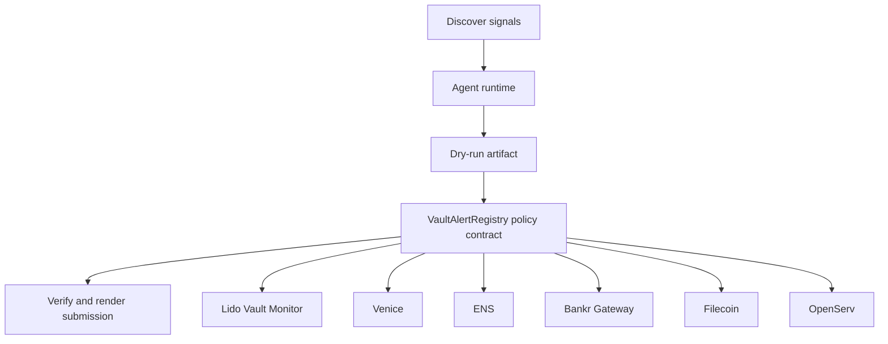

# VaultBeacon Sentinel

- **Repo:** `Synthesis-Lido-VaultMonitor`
- **Primary track:** Lido Vault Position Monitor + Alert Agent
- **Category:** monitoring
- **Submission status:** implementation ready, waiting for credentials and TxIDs.

A monitoring agent that tracks vault allocations, benchmark yield shifts, and operator thresholds, then emits plain-language alerts and MCP-callable responses.

## Selected concept

A monitoring agent pulls vault allocations, benchmark feeds, and risk thresholds into a plain-language alert stream. The contract layer only stores alert commitments and severity receipts so operators can prove alerts were generated before any downstream change is proposed.

## Idea shortlist

1. Earn Vault Yield Comparator
2. Private Risk Alert Desk
3. MCP-Callable Vault Copilot

## Partners covered

Lido Vault Monitor, Venice, ENS, Bankr Gateway, Filecoin, OpenServ

## Architecture



## Repository layout

- `src/`: shared policy contracts plus the repo-specific wrapper contract.
- `script/`: Foundry deployment entrypoint.
- `agents/`: Python runtime, partner adapters, and project metadata.
- `scripts/`: CLI utilities for running the loop and rendering submissions.
- `docs/`: architecture, credentials, demo script, and security notes.
- `submissions/`: generated `synthesis.md` snippet for this repo.

## Action catalog

| Action | Partner | Purpose | Max USD | Sensitivity |
| --- | --- | --- | --- | --- |
| `lido_vault_monitor_vault_alert` | Lido Vault Monitor | Use Lido Vault Monitor for a bounded action in this repo. | $1 | medium |
| `venice_private_analysis` | Venice | Use Venice for a bounded action in this repo. | $5 | high |
| `ens_ens_publish` | ENS | Use ENS for a bounded action in this repo. | $5 | low |
| `bankr_gateway_compute_route` | Bankr Gateway | Use Bankr Gateway for a bounded action in this repo. | $10 | high |
| `filecoin_proof_store` | Filecoin | Use Filecoin for a bounded action in this repo. | $20 | medium |
| `openserv_job_dispatch` | OpenServ | Use OpenServ for a bounded action in this repo. | $10 | medium |

## Commands

```bash
python3 -m unittest discover -s tests
forge test
python3 scripts/run_agent.py
python3 scripts/plan_live_demo.py
python3 scripts/render_submission.py
```

## Credentials

| Partner | Variables | Docs |
| --- | --- | --- |
| Lido Vault Monitor | RPC_URL | https://docs.lido.fi/ |
| Venice | VENICE_API_KEY, VENICE_CHAT_COMPLETIONS_URL, VENICE_MODEL | https://docs.venice.ai/ |
| ENS | ENS_NAME | https://docs.ens.domains/ |
| Bankr Gateway | BANKR_API_KEY, BANKR_CHAT_COMPLETIONS_URL, BANKR_MODEL | https://bankr.bot/ |
| Filecoin | FILECOIN_API_TOKEN, FILECOIN_UPLOAD_URL | https://docs.filecoin.cloud/ |
| OpenServ | OPENSERV_API_KEY, OPENSERV_AGENT_URL | https://docs.openserv.ai/ |

## Live demo plan

1. Copy .env.example to .env and fill the required keys.
2. Deploy the contract with forge script script/Deploy.s.sol --broadcast for VaultAlertRegistry.
3. Run python3 scripts/run_agent.py to produce a dry run for vault_monitor.
4. Set LIVE_MODE=true and rerun python3 scripts/run_agent.py with real credentials.
5. Run python3 scripts/render_submission.py and attach TxIDs plus repo links.
