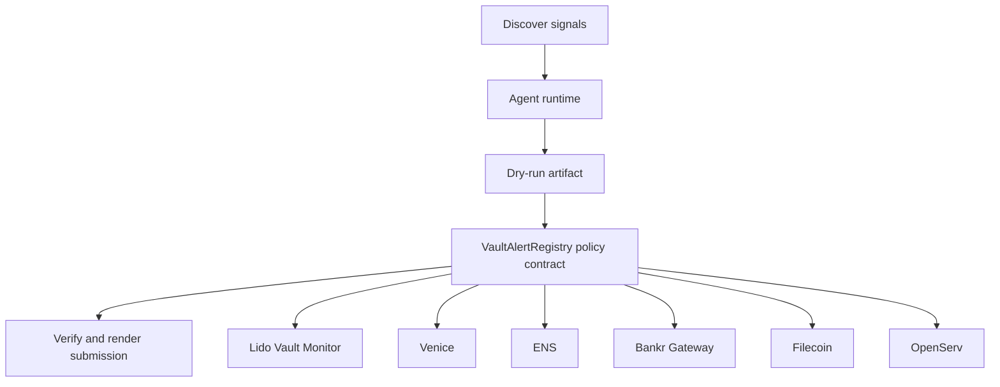

# VaultBeacon Sentinel

- **Repo:** [Synthesis-Lido-VaultMonitor](https://github.com/CrystallineButterfly/Synthesis-Lido-VaultMonitor)
- **Primary track:** Lido Vault Position Monitor + Alert Agent
- **Category:** monitoring
- **Primary contract:** `VaultAlertRegistry`
- **Primary module:** `vault_monitor`
- **Submission status:** audited and offline-demo ready; optional live partner credentials unlock network execution.

## What this repo does

A monitoring agent that tracks vault allocations, benchmark yield shifts, and operator thresholds, then emits plain-language alerts and MCP-callable responses.

## Why this build matters

A monitoring agent pulls vault allocations, benchmark feeds, and risk thresholds into a plain-language alert stream. The contract layer only stores alert commitments and severity receipts so operators can prove alerts were generated before any downstream change is proposed.

## Submission fit

- **Primary track:** Lido Vault Position Monitor + Alert Agent
- **Overlap targets:** Venice Private Agents, ENS, Bankr Gateway, Filecoin, OpenServ
- **Partners covered:** Lido Vault Monitor, Venice, ENS, Bankr Gateway, Filecoin, OpenServ

## Idea shortlist

1. Earn Vault Yield Comparator
2. Private Risk Alert Desk
3. MCP-Callable Vault Copilot

## System graph



## Repository contents

| Path | What it contains |
| --- | --- |
| `src/` | Shared policy contracts plus the repo-specific wrapper contract. |
| `script/Deploy.s.sol` | Foundry deployment entrypoint for the policy contract. |
| `agents/` | Python runtime, project spec, env handling, and partner adapters. |
| `scripts/` | Terminal entrypoints for run, demo planning, and submission rendering. |
| `docs/` | Architecture, credentials, security notes, and demo steps. |
| `submissions/` | Generated `synthesis.md` snippet for this repo. |
| `test/` | Foundry tests for the Solidity control layer. |
| `tests/` | Python tests for runtime and project context. |
| `agent.json` | Submission-facing agent manifest. |
| `agent_log.json` | Local execution log and status trail. |

## Autonomy loop

1. Discover signals relevant to the repo track and its overlap targets.
2. Build a bounded plan with per-action and compute caps.
3. Persist a dry-run artifact before any live execution.
4. Enforce onchain policy through the guarded contract wrapper.
5. Verify outputs, update receipts, and render submission material.

## Current readiness

- **Latest verification:** `verified` at `2026-03-19T03:52:13+00:00`
- **Execution mode:** `offline_prepared`
- **Offline-prepared partners:** Lido Vault Monitor (prepared_contract_call), ENS (prepared_contract_call), Filecoin (prepared_filecoin_bundle)
- **Live credential blockers:** Venice, Bankr Gateway, OpenServ
- **Audit docs:** `docs/audit.md`, `docs/live_readiness.md`

## Most sensitive actions

- `venice_private_analysis` (Venice, high)
- `bankr_gateway_compute_route` (Bankr Gateway, high)

## Live blocker details

- **Venice** — VENICE_API_KEY, VENICE_CHAT_COMPLETIONS_URL, VENICE_MODEL — https://docs.venice.ai/
- **Bankr Gateway** — BANKR_API_KEY, BANKR_CHAT_COMPLETIONS_URL, BANKR_MODEL — https://bankr.bot/
- **OpenServ** — OPENSERV_API_KEY, OPENSERV_AGENT_URL — https://docs.openserv.ai/

## Latest evidence artifacts

- `artifacts/onchain_intents/lido_vault_monitor_vault_alert.json`
- `artifacts/onchain_intents/ens_ens_publish.json`
- `artifacts/filecoin/0x279e5946ecc0c673a483cdc1b222c4561d46b32c9706c1ca3a33f14d108613aa.json`

## Security controls

- Admin-managed allowlists for targets and selectors.
- Per-action caps, daily caps, cooldown windows, and a principal floor.
- Reporter-only receipt anchoring and proof attachment.
- Env-only secrets; no committed private keys or partner tokens.
- Pause switch plus dry-run-first execution flow.

## Action catalog

| Action | Partner | Purpose | Max USD | Sensitivity |
| --- | --- | --- | --- | --- |
| `lido_vault_monitor_vault_alert` | Lido Vault Monitor | Use Lido Vault Monitor for a bounded action in this repo. | $1 | medium |
| `venice_private_analysis` | Venice | Use Venice for a bounded action in this repo. | $5 | high |
| `ens_ens_publish` | ENS | Use ENS for a bounded action in this repo. | $5 | low |
| `bankr_gateway_compute_route` | Bankr Gateway | Use Bankr Gateway for a bounded action in this repo. | $10 | high |
| `filecoin_proof_store` | Filecoin | Use Filecoin for a bounded action in this repo. | $20 | medium |
| `openserv_job_dispatch` | OpenServ | Use OpenServ for a bounded action in this repo. | $10 | medium |

## Local terminal flow (Anvil + Sepolia)

```bash
export SEPOLIA_RPC_URL=https://sepolia.infura.io/v3/YOUR_KEY
anvil --fork-url "$SEPOLIA_RPC_URL" --chain-id 11155111
cp .env.example .env
# keep private keys only in .env; TODO.md stays local-only too
forge script script/Deploy.s.sol --rpc-url "$RPC_URL" --broadcast
python3 scripts/run_agent.py
python3 scripts/render_submission.py
```

## Commands

```bash
python3 -m unittest discover -s tests
forge test
python3 scripts/run_agent.py
python3 scripts/plan_live_demo.py
python3 scripts/render_submission.py
```

## Credentials

| Partner | Variables | Docs |
| --- | --- | --- |
| Lido Vault Monitor | RPC_URL | https://docs.lido.fi/ |
| Venice | VENICE_API_KEY, VENICE_CHAT_COMPLETIONS_URL, VENICE_MODEL | https://docs.venice.ai/ |
| ENS | ENS_NAME | https://docs.ens.domains/ |
| Bankr Gateway | BANKR_API_KEY, BANKR_CHAT_COMPLETIONS_URL, BANKR_MODEL | https://bankr.bot/ |
| Filecoin | FILECOIN_API_TOKEN, FILECOIN_UPLOAD_URL | https://docs.filecoin.cloud/ |
| OpenServ | OPENSERV_API_KEY, OPENSERV_AGENT_URL | https://docs.openserv.ai/ |

## Live demo plan

1. Copy .env.example to .env and fill the required keys.
2. Deploy the contract with forge script script/Deploy.s.sol --broadcast for VaultAlertRegistry.
3. Run python3 scripts/run_agent.py to produce a dry run for vault_monitor.
4. Set LIVE_MODE=true and rerun python3 scripts/run_agent.py with real credentials.
5. Run python3 scripts/render_submission.py and attach TxIDs plus repo links.
